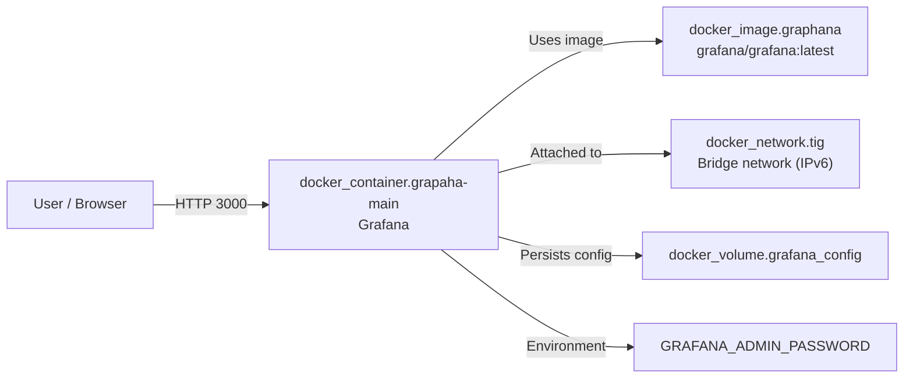
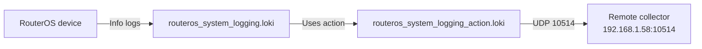

# Terraform component diagrams

## Graphana module

This module creates a Docker bridge network, pulls the Grafana image, mounts a persistent volume for `/var/lib/graphana`, and runs a container exposed on port `3000`.

## Mikrotik module

This module configures RouterOS to send `info` level syslog entries to a remote Loki endpoint over UDP on port `10514`.
